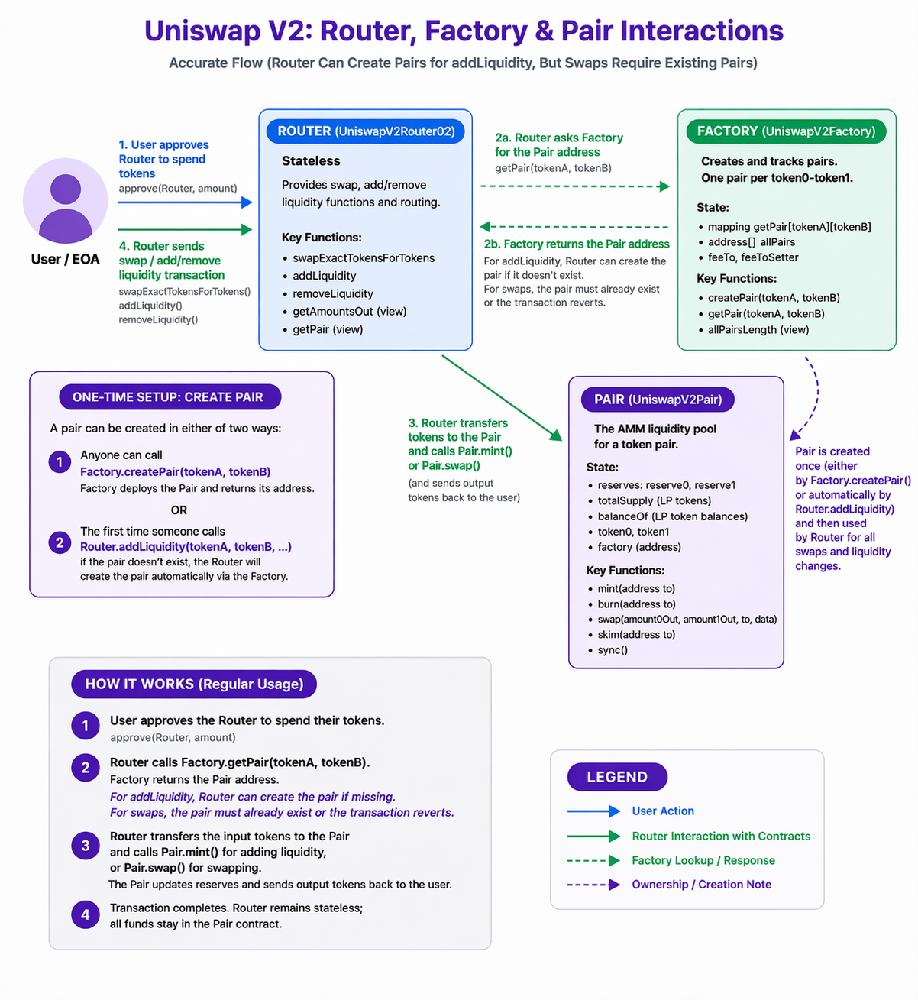
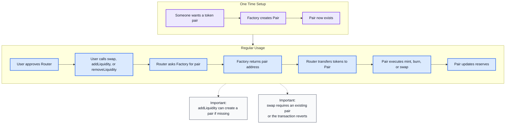

# Uniswap V2 Security Analysis

A comprehensive deep-dive into Uniswap V2's AMM security patterns through line-by-line code analysis.

**Author:** z0L  
**Date:** May 3, 2026  
**Status:** Complete  

---

## Table of Contents

- [What is Uniswap?](#what-is-uniswap)
    - [How Users Interact with Uniswap?](#how-users-interact-with-uniswap)
- [Core Concepts](#core-concepts)
    - [The Constant Product Formula](#the-constant-product-formula-largex-times-y--k)
        - [The Basic Idea](#the-basic-idea)
        - [How Swaps Work?](#how-swaps-work)
        - [Why This Works?](#why-this-works)
        - [The Price Impact](#the-price-impact)
        - [Trading Fees](#trading-fees-1)
        - [Visual Analogy](#visual-analogy)
    - [Liquidity Provision](#liquidity-provision)
        - [What are LP Tokens?](#what-are-lp-tokens)
        - [How Shares are Calculated?](#how-shares-are-calculated)
        - [Why LP Tokens Matter?](#why-lp-tokens-matter)
    - [Trading Fees](#trading-fees)
        - [How the 0.3% Fee Works?](#how-the-03-fee-works)
        - [Where Fees Go?](#where-fees-go)
        - [Fee Distribution](#fee-distribution)
        - [Protocol Fees (Extra Info)](#protocol-fees-extra-info)
    - [Contract Deep Dive](#contract-deep-dive)
        - [Architecture](#architecture)
        - [Process Flow](#process-flow)
    - [Key Functions](#key-functions)
        - [`swap()`](#swap)
        - [`mint()`](#mint)
        - [`burn()`](#burn)
        - [`skim()`](#skim)
        - [`sync()`](#sync)
- [Handling Non-Standard ERC20s](#handling-non-standard-erc20s)
    - [Supported Weird Behaviors](#supported-weird-behaviors)
    - [Unsupported Dangerous Behaviors](#unsupporteddangerous-behaviors)
---

## What is Uniswap?

Uniswap is a decentralized exchange ***(DEX)*** that lets you swap tokens without a middleman. Instead of matching buyers and sellers like traditional exchanges, Uniswap uses **liquidity pools** and **smart contracts** to enable trading.

**Key features:**

- **No intermediaries:** Trades happen directly between users and smart contracts
- **Permissionless:** Anyone can trade or provide liquidity
- **Non-upgradable:** The contracts are permanent and can't be changed
- **Self-custody:** You always control your tokens

### How Users Interact with Uniswap?

**Swapping tokens:**

1. Choose which tokens to trade ***(e.g., ETH → USDC)***
2. Enter amount
3. Click "Swap"
4. Router contract executes the trade through the liquidity pool

**Providing liquidity (becoming an LP):**

1. Deposit equal value of two tokens ***(e.g., $1000 ETH + $1000 USDC)***
2. Receive LP tokens representing your share of the pool
3. Earn 0.3% fees from every swap that uses your liquidity

**Removing liquidity:**

1. Burn your LP tokens
2. Receive your share of the pool back
3. Your share includes earned fees ***(if any)***

---
## Core Concepts

### The Constant Product Formula $\large{(x \times y = k)}$

Uniswap pools work using a simple math rule: **the product of two token amounts always stays constant.**

#### The Basic Idea

Imagine a pool with two tokens: ETH and USDC.

- $\large {x}$ = amount of ETH in the pool ***(e.g., 100 ETH)***
- $\large {y}$ = amount of USDC in the pool ***(e.g., 200,000 USDC)***
- ${\large k}$ = ${\large x \times y}$ = a constant number ***(100 × 200,000 = 20,000,000)***

**The rule:** No matter what, $\large{x \times y}$ **must** always equal $\large{k}$ ***(20,000,000 in this example)***.

#### How Swaps Work?

When someone swaps tokens, they change the amounts in the pool, but $\large{k}$ **stays the same.**

**Example:** You want to buy 10 ETH.

1. You remove 10 ETH from the pool → pool now has **90 ETH**
2. To keep $\large k$ constant, you **must** add USDC to the pool
3. New equation: 90 × $\large{y}$ = 20,000,000
4. Solving: $\large{y}$ = 222,222 USDC
5. Pool already had 200,000 USDC, so you must add **22,222 USDC**

**Result:** You traded 22,222 USDC for 10 ETH.

#### Why This Works?

**Automatic pricing:** The formula automatically calculates how much you need to pay based on how much you want. No order books, no market makers, **just math**.

**The more you buy, the more expensive it gets:** If you try to buy a lot of one token, you drain the pool and the price gets worse. This protects the pool from being completely emptied.

**Always liquid:** As long as both tokens exist in the pool, you can always trade. The price just adjusts based on supply and demand.

#### The Price Impact

The price you pay depends on how much you're trading relative to the pool size:

- **Small trade:** Barely changes the pool ratio → good price
- **Large trade:** Significantly changes the pool ratio → worse price ***(called "slippage")***

**Example with our 100 ETH / 200,000 USDC pool:**

- Buy 1 ETH: Pay ~2,020 USDC ***(2,020 USDC/ETH)***
- Buy 10 ETH: Pay ~22,222 USDC ***(2,222 USDC/ETH)***
- Buy 50 ETH: Pay ~200,000 USDC ***(4,000 USDC/ETH)***

Notice how buying more gives you a worse price? That's the **constant product formula** at work.

#### Trading Fees

In reality, Uniswap charges a **0.3% fee** on every trade. This fee stays in the pool, so $\large{k}$ actually **grows** over time.

This means:

- Liquidity providers earn fees
- The pool value increases
- $\large{k}$ isn't perfectly constant ***(it increases slightly with each trade)***

**The core mechanism:** Balancing $\large{x}$ and $\large{y}$ to maintain their product, so it remains the same.

#### Visual Analogy


Think of the pool like a seesaw:

- One side has ETH, the other has USDC
- When you take ETH off one side, you must add USDC to the other to keep it balanced
- The "balance point" $\large {k}$ never changes
- The more you take, the more you must add to keep it balanced

>**NOTE:** Notice that this example uses an extreme trade, pulling 50% of the ETH out of the pool moved the implied price from 1,000 USDC/ETH to 4,000 USDC/ETH (a 4x increase). In a real, deep liquidity pool, individual swaps cause much smaller price movements. But this is exactly the dynamic that flash loan **price manipulation** attacks exploit: temporarily distorting a pool's reserves to move the spot price for downstream consumers ***(oracles, lending protocols)***. We'll return to this in the price-manipulation section.

---

### Liquidity Provision

#### What are LP Tokens?

**LP** ***(Liquidity Provider)*** **tokens** are ERC-20 tokens that represent your share of a liquidity pool.

When you provide liquidity:
- You deposit equal value of both tokens ***(e.g., $1000 ETH + $1000 USDC)***
- The contract mints LP tokens to you
- Your LP tokens represent your proportional ownership

**Example:**

- Pool has 100 ETH + 200,000 USDC
- You add 10 ETH + 20,000 USDC ***(10% of the pool)***
- You receive 10% of total LP token supply
- When you burn LP tokens later, you get back 10% of whatever is in the pool

#### How Shares are Calculated?

**First Liquidity Provider (Empty Pool):**

- Uses the square root formula: `liquidity = sqrt(amount0 × amount1) - MINIMUM_LIQUIDITY`
- The square root of the product ensures fair initial pricing regardless of token decimals or units
- The 1,000 wei `MINIMUM_LIQUIDITY` is burned to `address(0)` permanently
- Prevents donation attacks and ensures pool can never be fully drained
- Example: Add 100 ETH + 200,000 USDC → `sqrt(100 × 200,000) = sqrt(20,000,000)` ≈ 4,472 LP tokens ***(minus 1,000 burned = 4,471 LP)***

**Subsequent Liquidity Providers (Existing Pool):**

- Uses minimum ratio: `liquidity = min(amount0 * totalSupply / reserve0, amount1 * totalSupply / reserve1)`
- You receive LP tokens based on whichever token you deposited **less** of ***(proportionally)***
- Prevents single-sided liquidity exploits
- Example: Add 10 ETH + 20,000 USDC to 100 ETH + 200,000 USDC pool → Get 10% of LP supply

**Key Principle:**

- LP tokens always represent your **proportional ownership** of the pool
- If you own 10% of LP tokens, you own 10% of all reserves ***(including accumulated fees)***

#### Why LP Tokens Matter?

- They're tradeable ***(you can sell your position)***
- They auto-compound fees ***(fees stay in pool, your share grows)***
- They're the key to removing liquidity

---

### Trading Fees

#### How the 0.3% Fee Works?

Every swap charges a 0.3% fee on the input amount.

**Example:**

- You swap 1000 USDC for ETH
- Fee: 1000 × 0.003 = 3 USDC
- Actual amount swapped: 997 USDC
- The 3 USDC stays in the pool

#### Where Fees Go?

Fees aren't sent anywhere, they **stay in the pool**, which means:

- Pool reserves grow over time
- LP tokens represent more value
- LPs earn passively without claiming

**Math example:**

- Pool starts: 100 ETH + 200,000 USDC
- After many swaps: 100 ETH + 205,000 USDC ***(fees accumulated)***
- Your 10% LP tokens now represent 10 ETH + 20,500 USDC
- You earned 500 USDC in fees!

#### Fee Distribution

- Fees are distributed proportionally to all LPs
- No need to claim - they auto-compound
- The longer you provide liquidity, the more fees you earn

#### Protocol Fees (Extra Info)

Uniswap V2 has a mechanism for a 1/6th protocol fee ***(taking 0.05% of the 0.3%)***, but it's currently turned off. If enabled, the protocol would mint LP tokens to a designated address.

---

## Contract Deep Dive

### Architecture



Uniswap V2 consists of three main contracts:

1. Router **(`UniswapV2Router02`)**

**Stateless helper contract** that provides user-friendly functions for swapping and managing liquidity. Users interact with the Router, not directly with Pairs.

2. Factory **(`UniswapV2Factory`)**

**Registry contract** that creates and tracks all Pair contracts. One pair per unique `token0`-`token1` combination.

3. Pair **(`UniswapV2Pair`)**

**The liquidity pool** that holds reserves and executes swaps using the constant product formula.

#### Process Flow


---

### Key Functions

#### `swap()`

```js
function swap(uint amount0Out, uint amount1Out, address to, bytes calldata data) external lock {
    // Validate at least one output amount
    require(amount0Out > 0 || amount1Out > 0, 'UniswapV2: INSUFFICIENT_OUTPUT_AMOUNT');
    (uint112 _reserve0, uint112 _reserve1,) = getReserves();
    
    // Ensure sufficient liquidity exists
    require(amount0Out < _reserve0 && amount1Out < _reserve1, 'UniswapV2: INSUFFICIENT_LIQUIDITY');

    uint balance0;
    uint balance1;
    {
        address _token0 = token0;
        address _token1 = token1;
        
        // Prevent sending tokens to token contracts themselves
        require(to != _token0 && to != _token1, 'UniswapV2: INVALID_TO');
        
        // Optimistically transfer output tokens
        if (amount0Out > 0) _safeTransfer(_token0, to, amount0Out);
        if (amount1Out > 0) _safeTransfer(_token1, to, amount1Out);
        
        // Flash swap callback if data provided
        if (data.length > 0) IUniswapV2Callee(to).uniswapV2Call(msg.sender, amount0Out, amount1Out, data);
        
        // Read actual balances after transfers and callback
        balance0 = IERC20(_token0).balanceOf(address(this));
        balance1 = IERC20(_token1).balanceOf(address(this));
    }
    
    // Calculate input amounts from balance changes (can't be spoofed)
    uint amount0In = balance0 > _reserve0 - amount0Out ? balance0 - (_reserve0 - amount0Out) : 0;
    uint amount1In = balance1 > _reserve1 - amount1Out ? balance1 - (_reserve1 - amount1Out) : 0;
    
    // Validate input was provided
    require(amount0In > 0 || amount1In > 0, 'UniswapV2: INSUFFICIENT_INPUT_AMOUNT');
    
    {
        // Adjust balances to account for 0.3% fee
        uint balance0Adjusted = balance0.mul(1000).sub(amount0In.mul(3));
        uint balance1Adjusted = balance1.mul(1000).sub(amount1In.mul(3));
        
        // K invariant check: ensures constant product holds after fees
        require(balance0Adjusted.mul(balance1Adjusted) >= uint(_reserve0).mul(_reserve1).mul(1000**2), 'UniswapV2: K');
    }

    _update(balance0, balance1, _reserve0, _reserve1);
    emit Swap(msg.sender, amount0In, amount1In, amount0Out, amount1Out, to);
}
```

**Purpose:** Exchange one token for another using the constant product formula.

**When it's needed:**

- User wants to trade `token0` for `token1` ***(or vice versa)***
- Flash swaps ***(borrow tokens, use them, repay in same transaction)***
- Arbitrage opportunities ***(profit from price differences between exchanges)***

**How it works:**

1. Validates output amounts are greater than 0 and less than reserves
2. **Optimistically transfers** output tokens to recipient ***(sends before receiving payment)***
3. If `data` is provided, calls callback on recipient ***(enables flash swaps)***
4. Reads actual balances to calculate input amounts
5. Validates input amounts are greater than 0
6. **Checks ${\Large k}$ invariant** with 0.3% fee adjustment
7. Updates reserves to reflect new balances
8. Emits `Swap` event

**Security mechanisms:**

- **`lock` modifier:** Prevents reentrancy attacks
- **Balance-based input calculation:** Can't spoof amounts - `amountIn = balance - (reserve - amountOut)`
- ${\Large k}$ **invariant check:** Ensures `(balance0 * 1000 - amountIn * 3) * (balance1 * 1000 - amountIn * 3) >= reserve0 * reserve1 * 1000**2`
- **Fee enforcement:** 0.3% fee automatically deducted via invariant math
- **`to` address check:** Prevents sending tokens to token contracts themselves

**Example:**

```js
**// Pool state:
reserve0: 100 ETH
reserve1: 200,000 USDC

// User wants 1 ETH:
Router sends USDC to pair
Router calls swap(1 ETH, 0, user, "")

// Pair:
1. Sends 1 ETH to user (optimistic transfer)
2. Checks balance: received ~2,020 USDC
3. Verifies K: (99 ETH * 202,020 USDC) >= (100 ETH * 200,000 USDC) ✓
4. Updates reserves: 99 ETH, 202,020 USDC

// User paid ~2,020 USDC for 1 ETH
// Pool earned ~20 USDC in fees (0.3% of 2,020)**
```

**Attack vectors prevented:**

- **Reentrancy:** `lock` modifier stops recursive calls
- **Bypassing payment:** Balance-based calculation ensures tokens were actually sent
- **Price manipulation:** $\large {k}$ invariant prevents extracting value
- **Fee evasion:** Math enforces fees automatically
- **Self-transfer exploits:** `to` address validation

**Key insight:** The optimistic transfer ***(send tokens before receiving payment)*** is **SAFE** because the $\large k$ invariant check happens after. If payment wasn't received, the invariant check fails and the entire transaction reverts.

---

#### `mint()`

```js
function mint(address to) external lock returns (uint liquidity) {
    (uint112 _reserve0, uint112 _reserve1,) = getReserves();
    
    // Calculate amounts added from balance changes
    uint balance0 = IERC20(token0).balanceOf(address(this));
    uint balance1 = IERC20(token1).balanceOf(address(this));
    uint amount0 = balance0.sub(_reserve0);
    uint amount1 = balance1.sub(_reserve1);

    bool feeOn = _mintFee(_reserve0, _reserve1);
    uint _totalSupply = totalSupply;
    
    if (_totalSupply == 0) {
        // First LP: use geometric mean minus minimum liquidity
        liquidity = Math.sqrt(amount0.mul(amount1)).sub(MINIMUM_LIQUIDITY);
        _mint(address(0), MINIMUM_LIQUIDITY); // Permanently lock first MINIMUM_LIQUIDITY tokens
    } else {
        // Subsequent LPs: proportional to pool ratio (use minimum to prevent single-sided exploits)
        liquidity = Math.min(amount0.mul(_totalSupply) / _reserve0, amount1.mul(_totalSupply) / _reserve1);
    }
    
    require(liquidity > 0, 'UniswapV2: INSUFFICIENT_LIQUIDITY_MINTED');
    _mint(to, liquidity);

    _update(balance0, balance1, _reserve0, _reserve1);
    if (feeOn) kLast = uint(reserve0).mul(reserve1);
    emit Mint(msg.sender, amount0, amount1);
}
```

**Purpose:** Add liquidity to the pool and receive LP tokens representing your share.

**When it's needed:**

- First time liquidity is added to a new pool
- Subsequent liquidity additions to existing pool
- User wants to earn trading fees as an LP

**How it works:**

1. Reads current balances and calculates amounts added ***(balance - reserve)***
2. Calls `_mintFee()` to handle protocol fees if enabled
3. **For first LP:** `liquidity = sqrt(amount0 * amount1) - MINIMUM_LIQUIDITY`
    - Burns 1000 wei LP tokens to address(0) permanently
4. **For subsequent LPs:** `liquidity = min(amount0 * totalSupply / reserve0, amount1 * totalSupply / reserve1)`
    - Uses `min()` to prevent single-sided liquidity exploits
5. Validates `liquidity > 0`
6. Mints LP tokens to recipient
7. Updates reserves to new balances
8. Updates `kLast` if fees enabled
9. Emits `Mint` event

**Security mechanisms:**

- **`lock` modifier:** Prevents reentrancy
- **Balance-based calculation:** Can't fake deposit amounts
- **`MINIMUM_LIQUIDITY` burn:** Prevents donation attack on first mint
- **`min()` formula:** Prevents getting LP tokens for single-sided deposits
- **Division after multiplication:** Preserves precision
- **Pro-rata distribution:** LP tokens always represent fair pool share

**Example:**

```js
// First LP (pool is empty):
User sends: 100 ETH + 200,000 USDC
liquidity = sqrt(100 * 200,000) - 1000 = sqrt(20,000,000) - 1000
liquidity = 4,472 - 1 ≈ 4,471 LP tokens
(1000 wei burned to address(0))

// Second LP (pool has 100 ETH + 200,000 USDC, 4,471 LP supply):
User sends: 10 ETH + 20,000 USDC
liquidity = min(
    10 * 4,471 / 100,     // = 447.1
    20,000 * 4,471 / 200,000  // = 447.1
)
liquidity = 447 LP tokens

// User owns 447 / (4,471 + 447) = ~9.1% of pool
// Gets 9.1% of all future trading fees
```

**Attack vectors prevented:**

- **Donation attack:** `MINIMUM_LIQUIDITY` makes initial donation uneconomical
    - Without it: Attacker adds 1 wei, donates 1000 ETH, next LP gets unfair ratio
    - With it: First LP must provide meaningful liquidity ***(>1000 wei worth)***
- **Single-sided liquidity:** `min()` ensures you get LP for the SMALLER ratio
    - Try to add 100 ETH + 1 USDC → Only get LP for 1 USDC worth
- **Balance spoofing:** Actual balances used, can't lie about amounts
- **Precision loss:** Multiplication before division

**Key insight:** The geometric mean **(`sqrt(amount0 * amount1)`)** for initial LP is brilliant because it's unit-independent. Whether pool is ETH/USDC or ETH/DAI, the initial LP formula treats both tokens fairly based on the chosen ratio.

---
#### `burn()`

```js
function burn(address to) external lock returns (uint amount0, uint amount1) {
    (uint112 _reserve0, uint112 _reserve1,) = getReserves();
    address _token0 = token0;
    address _token1 = token1;
    uint balance0 = IERC20(_token0).balanceOf(address(this));
    uint balance1 = IERC20(_token1).balanceOf(address(this));
    
    // LP tokens to burn (must be sent to pair first)
    uint liquidity = balanceOf[address(this)];

    bool feeOn = _mintFee(_reserve0, _reserve1);
    uint _totalSupply = totalSupply;
    
    // Calculate proportional amounts to return
    amount0 = liquidity.mul(balance0) / _totalSupply;
    amount1 = liquidity.mul(balance1) / _totalSupply;
    require(amount0 > 0 && amount1 > 0, 'UniswapV2: INSUFFICIENT_LIQUIDITY_BURNED');
    
    // Burn LP tokens before transferring (prevents reentrancy)
    _burn(address(this), liquidity);
    _safeTransfer(_token0, to, amount0);
    _safeTransfer(_token1, to, amount1);
    
    // Re-check balances after transfers (handles fee-on-transfer tokens)
    balance0 = IERC20(_token0).balanceOf(address(this));
    balance1 = IERC20(_token1).balanceOf(address(this));

    _update(balance0, balance1, _reserve0, _reserve1);
    if (feeOn) kLast = uint(reserve0).mul(reserve1);
    emit Burn(msg.sender, amount0, amount1, to);
}
```

**Purpose:** Remove liquidity from the pool by burning LP tokens and receiving proportional amounts of both tokens.

**When it's needed:**

- User wants to exit their liquidity position
- User wants to claim accumulated fees
- Rebalancing liquidity across different pools

**How it works:**

1. Reads current balances and LP token amount in contract **(`balanceOf[address(this)]`)**
2. Calls `_mintFee()` to handle protocol fees if enabled
3. Calculates amounts to return: `amount = liquidity * balance / totalSupply`
4. Validates both amounts greater than 0
5. **Burns LP tokens** from contract's balance
6. Transfers `token0` and `token1` to recipient
7. Re-reads balances after transfers ***(handles [fee-on-transfer](https://github.com/d-xo/weird-erc20#fee-on-transfer) tokens)***
8. Updates reserves to new balances
9. Updates `kLast` if fees enabled
10. Emits `Burn` event

**Security mechanisms:**

- **`lock` modifier:** Prevents reentrancy
- **Uses LP tokens already in contract:** Can't burn more than you sent
- **Pro-rata calculation:** Fair distribution based on ownership
- **Burn before transfer:** Prevents double-withdrawal via reentrancy
- **Balance re-check:** Handles weird token behavior ***(transfer fees)***
- **Division after multiplication:** Preserves precision

**Example:**

```js
// Pool state:
reserves: 100 ETH + 200,000 USDC
totalSupply: 4,471 LP tokens
User owns: 447 LP tokens (~10%)

// User removes liquidity:
1. User transfers 447 LP to pair
2. Pair burns 447 LP tokens
3. Pair calculates:
   amount0 = 447 * 100 / 4,471 ≈ 10 ETH
   amount1 = 447 * 200,000 / 4,471 ≈ 20,000 USDC
4. Pair sends 10 ETH + 20,000 USDC to user

// User received ~10% of pool (their share)
// This includes any fees earned while providing liquidity
```

**Attack vectors prevented:**

- **Burning more than you own:** LP tokens must be in contract first
    - Router transfers user's LP → Pair → Pair burns what it received
- **Reentrancy:** Burn happens BEFORE transfers
    - Can't reenter during token transfer to burn same LP twice
- **Getting more than your share:** Math is exact and proportional
- **Weird token exploits:** Balance re-check after transfer handles fee-on-transfer tokens

**Key insight:** Using `balanceOf[address(this)]` ***(LP tokens the pair holds)*** instead of taking `liquidity` as a parameter prevents spoofing. You must actually **SEND** LP tokens to the pair before calling burn. The Router handles this in two steps: transfer LP, then call burn.

---

#### `skim()`

```js
function skim(address to) external lock {
    address _token0 = token0;
    address _token1 = token1;
    
    // Transfer excess tokens (balance - reserve) to specified address
    _safeTransfer(_token0, to, IERC20(_token0).balanceOf(address(this)).sub(reserve0));
    _safeTransfer(_token1, to, IERC20(_token1).balanceOf(address(this)).sub(reserve1));
}
```

**Purpose:** Remove excess tokens ***(balance > reserves)*** from the pair contract.

**When it's needed:**

- Someone accidentally sends tokens directly to pair
- After fee-on-transfer token reduces balance unexpectedly
- To prevent donation attacks

**How it works:**

1. Reads current balances of both tokens
2. Calculates excess: ***(balance - reserve)*** for each token
3. Transfers excess to specified address
4. Balances now match reserves exactly

**Security mechanisms:**

- **Lock modifier:** Prevents reentrancy
- **Anyone can call:** Permissionless cleanup ***(MEV bots typically call this)***
- **Can only transfer excess:** Cannot drain reserves themselves
- **Prevents donation manipulation:** Excess removed before affecting pricing

**Example:**

```js
// Normal state:
reserve0: 100 ETH
balance0: 100 ETH (matches)

// Someone sends 5 ETH directly to pair:
reserve0: 100 ETH (unchanged)
balance0: 105 ETH (increased)

// Call skim(alice):
excess = 105 - 100 = 5 ETH
Transfers 5 ETH to alice

// After skim:
reserve0: 100 ETH
balance0: 100 ETH (aligned again)
```

**Attack vectors prevented:**

- **Donation attacks:** MEV bots can immediately skim donated tokens
    - Attacker donates 1000 ETH hoping to manipulate next swap
    - MEV bot calls `skim()` instantly and takes the 1000 ETH
    - Donation has zero effect on pool pricing
- **Balance inflation:** Excess removed, pricing unaffected
- **Unfair advantage:** Prevents next trader from benefiting from donated tokens

**Key insight:** `skim()` and `sync()` are opposites:

- `skim()`: balance > reserve → remove excess → balance matches reserve
- `sync()`: balance ≠ reserve → update reserve → reserve matches balance

Use `skim()` when you want to **REMOVE** excess. Use `sync()` when you want to **ACKNOWLEDGE** the balance change.

---

#### `sync()`

```js
function sync() external lock {
    // Update reserves to match current balances
    _update(IERC20(token0).balanceOf(address(this)), IERC20(token1).balanceOf(address(this)), reserve0, reserve1);
}
```

**Purpose:** Update reserves to match current balances, accounting for token mechanics like transfer fees or rebasing.

**When it's needed:**

- After [rebasing token](https://github.com/d-xo/weird-erc20#balance-modifications-outside-of-transfers-rebasingairdrops) balance changes automatically
- After [fee-on-transfer](https://github.com/d-xo/weird-erc20#fee-on-transfer) token transfer
- When balance ≠ reserve due to token behavior ***(not donations)***
- To ensure reserves accurately reflect pool state

**How it works:**

1. Reads actual balances of both tokens
2. Calls `_update()` to set reserves = balances
3. Reserves now accurately reflect pool state
4. All LPs benefit proportionally from balance increases

**Security mechanisms:**

- **Lock modifier:** Prevents reentrancy
- **Anyone can call:** Permissionless ***(anyone can trigger sync when needed)***
- **Ensures accurate reserves:** Critical for [weird token](https://github.com/d-xo/weird-erc20) types
- **Fair distribution:** Balance increases benefit all LPs proportionally

**Example:**

```js
// Rebasing token increased balance:
reserve0: 100 stETH
balance0: 105 stETH (5% positive rebase occurred)

// Without sync():
Next swap/mint would see:
amount0 = 105 - 100 = 5 stETH as "new deposit"
First person to interact gets the 5 stETH (unfair!)

// With sync():
Call sync()
Updates reserve0 to 105 stETH
Now reserves match actual balances
Extra 5 stETH distributed fairly to ALL LPs

// All LP tokens now represent slightly more stETH
// Fair distribution of rebase rewards
```

**Attack vectors prevented:**

- **First-mover advantage:** Without `sync`, first person to interact after rebase captures all gains
- **Reserve de-sync:** Keeps reserves accurate for fee-on-transfer tokens
- **Oracle manipulation:** Accurate reserves mean accurate pricing

**Key difference from `skim()`:**

- **`skim()`:** Removes excess ***(balance - reserve)*** and sends to address
- **`sync()`:** Updates reserve to equal balance ***(keeps excess in pool)***

**When to use which:**

- Use `skim()` when someone **donated** ***(you want to remove excess)***
- Use `sync()` when token **rebased** or has **transfer fees** ***(you want to acknowledge new balance)***

**Key insight:** For standard ERC20 tokens, you'd never need `sync()` because balances only change through `mint`/`swap`/`burn` ***(which update reserves automatically)***. But for **weird tokens** ***(rebasing, fee-on-transfer, deflationary)***, `sync()` is critical to maintain accurate reserves.

---

## Handling Non-Standard ERC20s

Uniswap V2 is designed to work with standard ERC20 tokens, but also handles certain edge cases:

### Supported Weird Behaviors

**Fee-on-Transfer Tokens:**
- `burn()` re-checks balances after transfers
- `sync()` can update reserves to match actual balances
- Example: Tokens that take a % fee on every transfer

**Rebasing Tokens:**
- `sync()` updates reserves when balances change automatically
- Ensures reserves reflect current pool state
- Example: Tokens whose balances change based on external factors

### Unsupported/Dangerous Behaviors

**Not compatible with:**
- [Tokens with blocklists](https://github.com/d-xo/weird-erc20#tokens-with-blocklists) ***(can DoS the pair)***
- [Tokens that revert on zero value transfers](https://github.com/d-xo/weird-erc20#revert-on-zero-value-transfers)
- [Tokens with hooks](https://github.com/d-xo/weird-erc20#tokens-with-hooks) ***(reentrancy vectors)***
- [Upgradeable tokens](https://github.com/d-xo/weird-erc20#upgradable-tokens) ***(logic can change after pair creation)***

**Security note:** When auditing AMM forks, always check how they handle non-standard tokens. Many exploits happen when weird token behavior interacts unexpectedly with pool logic.

**Reference:** [weird-erc20 repository](https://github.com/d-xo/weird-erc20) - Comprehensive collection of non-standard ERC20 behaviors
